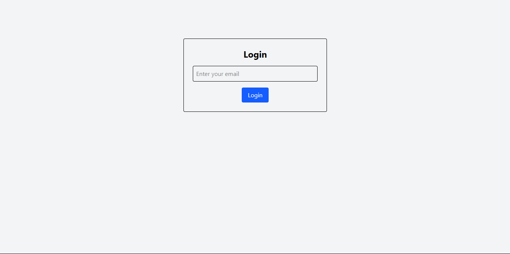
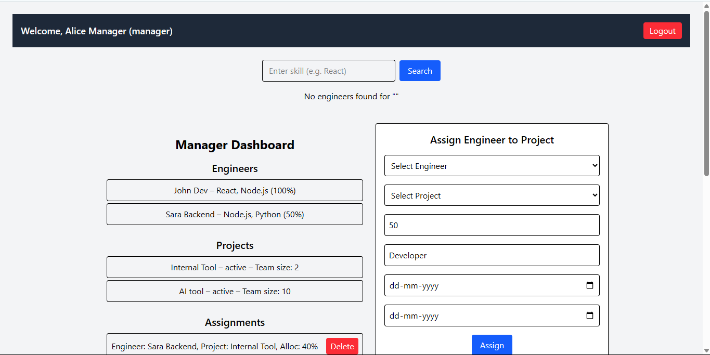
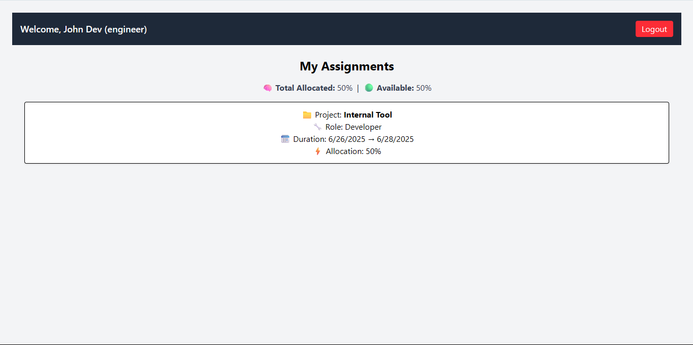

# 🛠️ Engineering Resource Planner

A full-stack engineering resource management tool to help managers assign engineers to projects based on skills, availability, and current workload. Engineers can track their current assignments and upcoming work.

---

## 📽️ Demo Video
Check out a walkthrough of the project:  
🔗 [Watch Demo Video on Loom](https://www.loom.com/share/10dfc04d274b43d6a25d3ed17f238a07?sid=cb508c65-46fb-412c-bf44-907ea79a9d39)


## 🚀 Features

### 👤 Authentication & Roles
- **Login System** with two roles: `Manager` and `Engineer`
- Engineers can **view their assignments**
- Managers can **manage projects** and **assign engineers**


manager@example.com → see full dashboard(Manager)  
john@example.com or sara@example.com → see only their assignments(Engineer)

### 👷 Engineer Management
- View engineer profiles: name, skills, seniority, and department
- Display current allocation and availability with **capacity bars**
- Engineers: Full-time (100%) or Part-time (50%) capacity

### 📁 Project Management
- Create projects with description, required skills, team size
- Track project status: `Planning`, `Active`, `Completed`
- Display **required skills as tags**

### 🔀 Assignment System
- Assign engineers to projects with percentage allocation
- View who’s working on what, and for how long
- Show **visual capacity indicators** for workload balance

### 📊 Dashboards
- **Manager Dashboard**: Team overview, utilization, project list
- **Engineer Dashboard**: View current and upcoming tasks
- **Assignment Timeline**: (Planned) Visual calendar for assignments




### 🔍 Search & Analytics
- Search engineers by skill

---

## 🧰 Tech Stack

| Layer       | Technology              |
|------------|--------------------------|
| Frontend   | React, Tailwind CSS      |
| Build Tool | Parcel                   |
| Backend    | Node.js, Express         |
| Database   | MongoDB (Mongoose)       |
| API Comm   | Fetch API (REST)         |

---

## Use of AI
*Tool Used:* ChatGPT (OpenAI) as a coding assistant.

*Used For:* Database schema design, API route generation, React component scaffolding, and bug fixing.

*AI Benefits:*

- Accelerated Mongoose model setup and backend logic like getAvailableCapacity().  
- Quickly generated Tailwind-based UI for dashboards and forms.
- Helped debug ObjectId casting and MongoDB indexing errors.

*Challenges:*

- Some syntax issues (e.g., using ObjectId without new) were fixed by cross-checking with Mongoose docs.
- React Router versions differed; adjusted code after reading official docs.

*Validation Approach:*
- Tested API endpoints manually via Postman.
- Verified AI-generated code through console logs and browser output.
- Always double-checked with official documentation.


## ⚙️ How to Run locally
### Clone & Install
```
git clone https://github.com/ShivamT16/geekyAnts.git
cd geekyAnts
```

#### For Frontend  
```
$ npm install
$ npm run dev       // run frontend       
```

#### For Backend
```
$ cd backend
$ npm install   

- Create a .env in your backend directory:

MONGODB_URI=mongodb+srv://<your_mongodb_uri>
PORT=5000

$ node seed.js      // seed sample data
$ node server.js   // run backend server
```